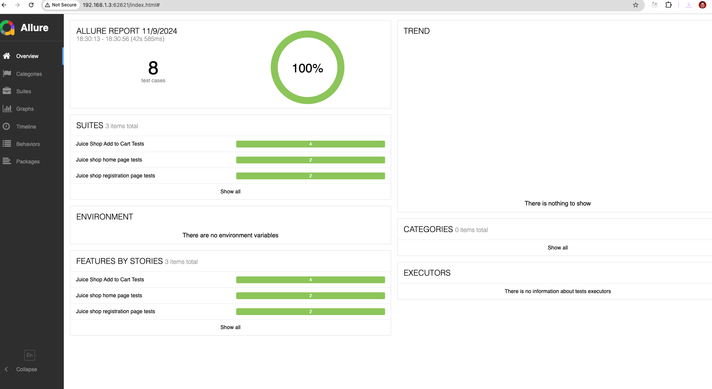
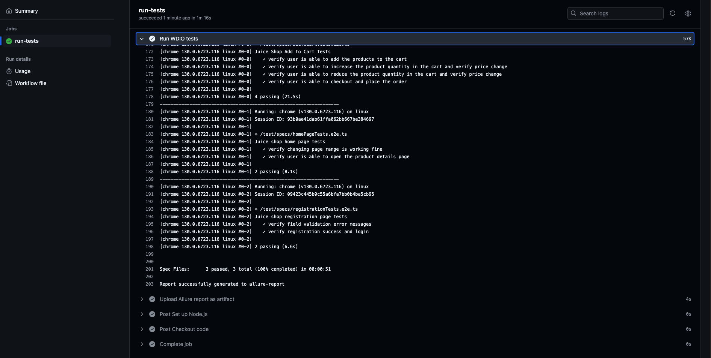

<!-- @format -->

# Juice shop test automation framework

This project is to automate the FE E2E test cases. It also uses APIs whereever its needed.

### Teck Stack:

- TypeScript
- WebDriver.io
- Allure (reporting tool)
- mocha (test runner)
- github actions (CICD)
- winston for logging
- Kubernetes to run tests in scale

## Folder structure

- Configs are stored at `config/conf.js`
- Locators are saved under `test/pageobjects`
- Page actions are saved under `test/pages`
- Tests are written at `test/specs`
- Helper and utility functions are saved under `utility`
- Wdio log messages are stored under `wdio_Logs`
- Test configuration are saved at `wdio.conf.ts`
- Test reports generates at `allure-reports`

> **Note:** While Allure is used here for reporting, I prefer [ReportPortal](reportportal.io) for detailed reporting and analysis. However, due to hosting requirements for ReportPortal, Allure was used in this project for simplicity.

### Env variables

Vriables are stored in the `.env`file

- `ENV` ['prod','staging','local'] to run tests in the specific environment
- `logger` to log the logs in the console default value is true
- `LOG_LEVEL` default is `info`
- `HEADLESS` to run test in the headless mode
- `BROWSER` ['chrome','edge','safari','firefox'] default value is `chrome`
- `isRetry` to trigger the retry of failing tests default value is `true`
- `GRID_HOST` if running tests on k8 grid

### Steps to run test

```shell
npm install
ENV= staging npm run test
```

### Steps to run test in k8 cluster

You need to setup the selenium grid on k8 cluster [steps](https://github.com/SeleniumHQ/docker-selenium/tree/trunk/charts/selenium-grid)

```shell
set the ENV GRID_HOST
npm install
ENV= staging npm run grid:test
```

### Steps to open report

```shell
brew install allure
Open directory where allure-report folder is present
allure open
```

Sample Report:


Sample pipeline result:

